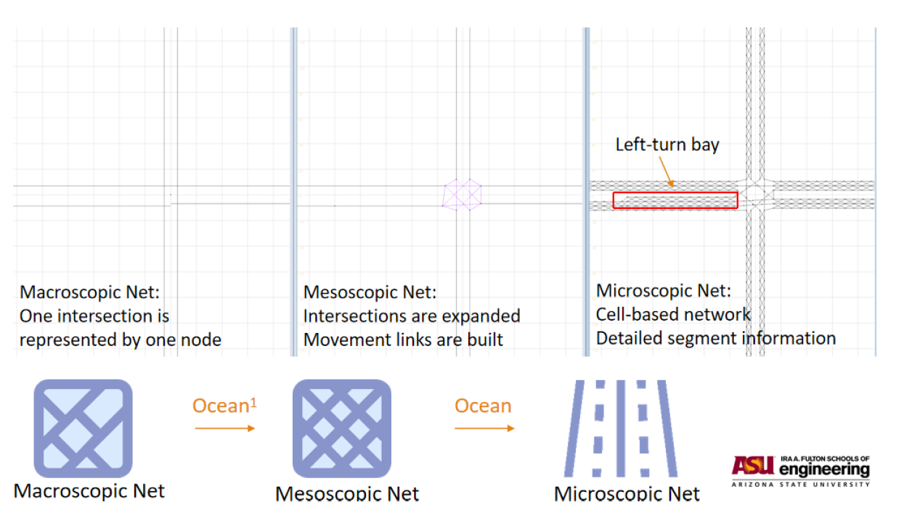
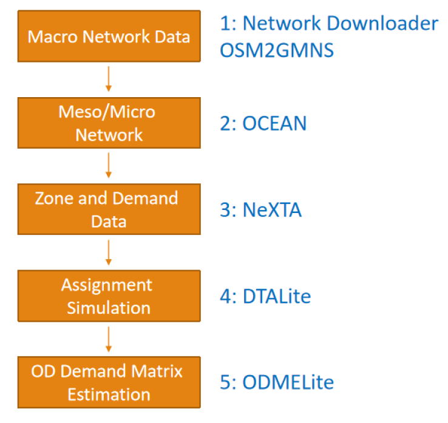
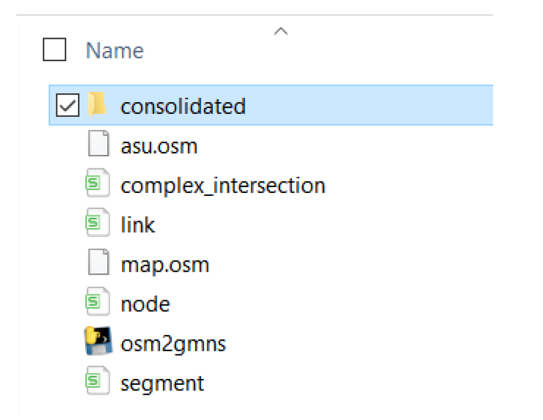
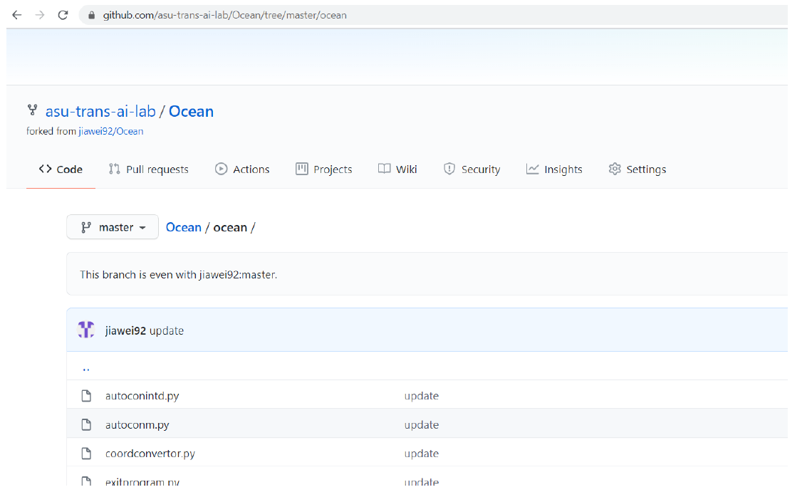
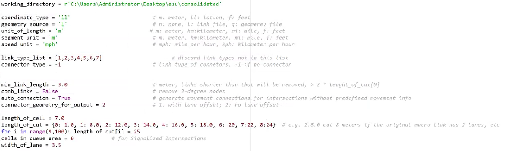
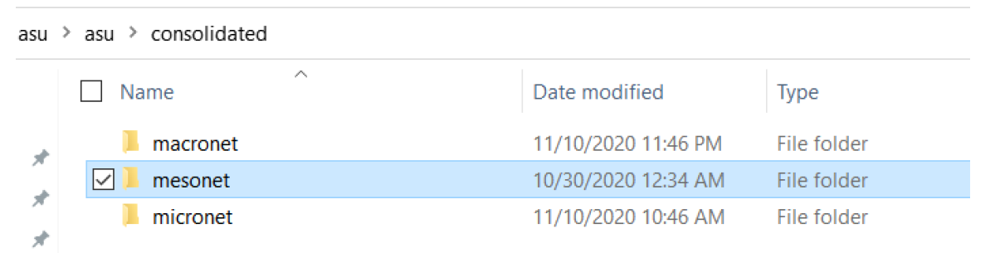
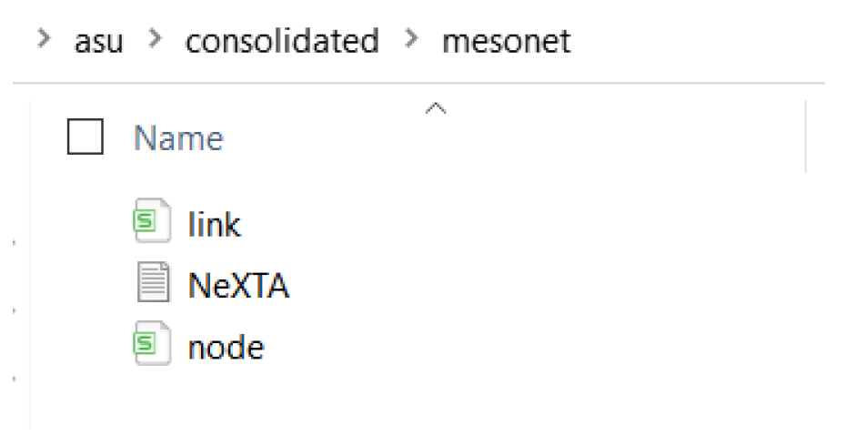
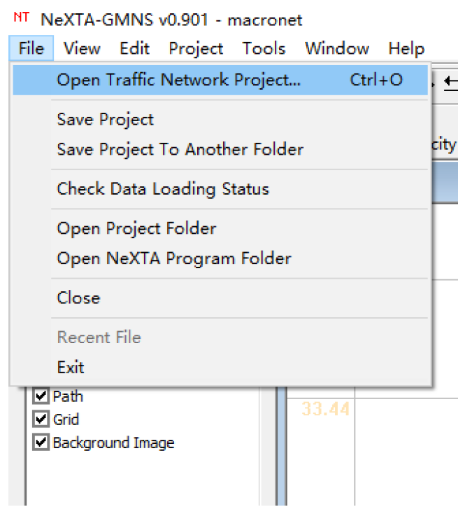
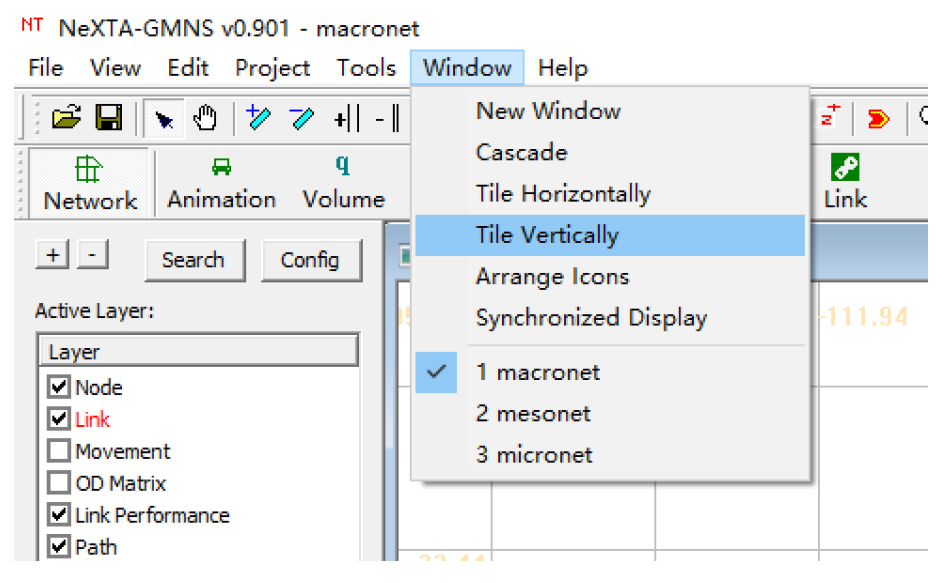

**Net2Cell for Multi-Resolution Network Modeling:**

**Open-source tool for creating Cell-based (microscopic) and mesoscopic and
macro Networks**

**Development Support:**

Ph.D. Student: Jiawei (Jay) Lu (jiaweil9\@asu.edu)

Dr. Xuesong (Simon) Zhou (xzhou74\@asu.edu)

School of Sustainable Engineering and the Built Environment

Arizona State University

>   **Overview of work flow**

**Step 1: Obtain macroscopic network data**

Use the OSM2GMNS tool to convert map.osm file in OSM format into a network file
in GMNS format, and the output includes node.csv and link.csv files. The
OSM2GMNS tool also generates important information such as the mapping between
“model nodes” and “main signal nodes”, which is recorded in file
complex_intersection.csv and segment.csv.

As shown above, ensure the following files are located in the “consolidated”
folder:

node.csv (required),

link.csv(required),

complex_intersection.csv(optional),

segment.csv(optional).

**Step 2: Obtain the OCEAN python code**

Go to the github website of OCEAN,

<https://github.com/asu-trans-ai-lab/Ocean/tree/master/ocean>

download the source codes insides the “ocean” folder, and open main.py file.

**Step 3: Configure network-related parameters**

Check and configure parameter values in the python code of main.py.

**Descriptions of parameters in the code**

| **working_directory**                            | File directory of node.csv and link.csv                                                    |
|--------------------------------------------------|--------------------------------------------------------------------------------------------|
| **coordinate_type**                              | Type of coordinate system, m: meter, ll: latlon, f: feet                                   |
| **geometry_source**                              | File source of geometry information, n: none, l: link file, g: geometry file               |
| **unit_of_length**                               | Minimum unit of link length, m: meter, km:kilometer, mi: mile, f: feet                     |
| **segment_unit**                                 | length unit for segment data, m: meter, km:kilometer, mi: mile, f: feet                    |
| **speed_unit**                                   | unit of traveling speed, mph: mile per hour, kph: kilometer per hour                       |
| **link_type_list**                               | List of allowed link types                                                                 |
| **connector_type**                               | link type of connectors in macroscopic network, -1 if no connector                         |
| **The following parameters have default values** |                                                                                            |
| **min_link_length**                              | meter, links shorter than that will be removed, \> 2 \* length_of_cut[0]                   |
| **comb_links**                                   | remove 2-degree nodes                                                                      |
| **auto_connection**                              | generate movement connections for intersections without predefined movement info           |
| **connector_geometry_for_output**                | 1: with lane offset; 2: no lane offset                                                     |
| **length_of_cell**                               | Length of a cell when generating microscopic networks from macro network                   |
| **length_of_cut**                                | Information of offset, e.g, 2:8.0 cut 8 meters if the original macro link has 2 lanes, etc |
| **cells_in_queue_area**                          | for signalized intersections                                                               |
| **width_of_lane**                                | Width of each lane                                                                         |

**Step 4: Execute OCEAN and generate networks**

Go to the github website of OCEAN,
<https://github.com/asu-trans-ai-lab/Ocean/tree/master/ocean>/test/asu_dataset**,**
download a test data set or use your own dataset.

Run the OCEAN program to generate three sets of file corresponding to
macroscopic, mesoscopic, and microscopic network in the folders shown below.
Each folder should have at least node.csv and link.csv files.

**Step 5: Visualize networks in NeXTA**

You can open and visualize the traffic network project (node.csv in three folds)
in NEXTA .

Use menu as shown below, then set the window layout to show three levels of
networks, through menu items “tile vertically” and “Synchronized Display” .

The potential next step is to manage OD zone structure and in the NeXTA tool and
perform traffic assignment and simulation using DTALite for transportation
network simulation and analysis.
